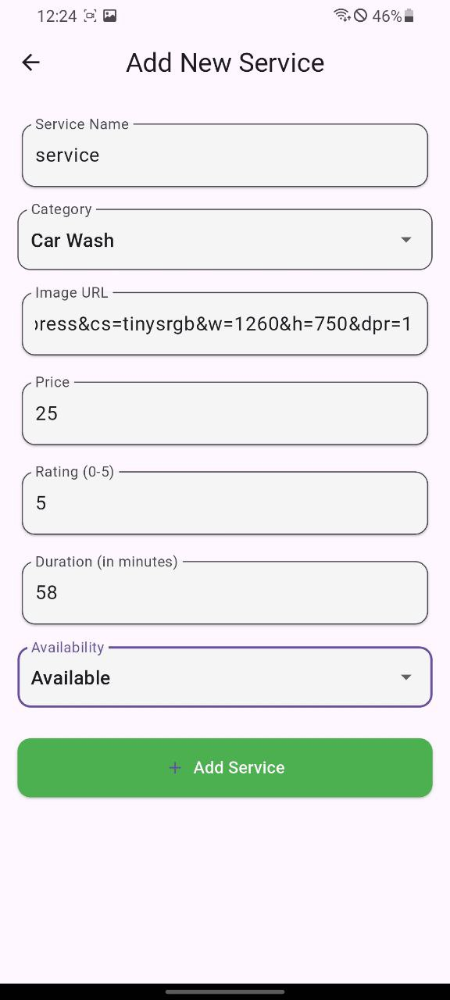

# 🛠️ Mini Service Booking App

A clean, responsive, and modern **Flutter frontend** for a Mini Service Booking App. It allows users to browse, search, filter, add, edit, and delete services using a public mock REST API. Built with **GetX**, **Clean Architecture**, and offline support.

---

## 📱 Screenshots

| Home Page                             | Service Details                         | Edit Service                          |
|--------------------------------------|-----------------------------------------|---------------------------------------|
|         |      |          |

> *(Include `.png` files inside `/screenshots` folder or replace with GIFs or video links.)*

---

## 🚀 Project Overview

This app serves as a **frontend-only** mini booking platform where users can:

- View a list of services
- Search and filter services by name, category, or rating
- Add a new service
- Edit or delete existing services
- View detailed information about a service
- See animated transitions between list and detail screens (using `Hero`)
- Simulate login
- View category chips and filtered service lists
- Experience smooth offline support via Hive

---

## 🧰 Tech Stack

- **Flutter**
- **GetX** (Routing, State Management, Dependency Injection, Localization)
- **Clean Architecture**
- **Hive** (Offline Support)
- **Mock REST API** ([MockAPI.io](https://mockapi.io/))

---

## 🛠️ Setup Instructions

1. **Clone the repository**
   ```bash
   git clone https://github.com/yourusername/mini_service_booking.git
   cd mini_service_booking
2. **Install dependencies**
   flutter pub get
3. **Run the app**
   flutter run
4. **Update API base URL (if needed)**
    Inside /lib/core/constants/api_constants.dart
    const baseUrl = 'https://681d1447f74de1d219aebf17.mockapi.io/api/v1/';

## 📦 Folder Structure
lib/
├── core/
│   ├── bindings/              # App-wide bindings for DI
│   ├── constants/             # API constants, app-wide strings
│   ├── utils/                 # 
├── data/
│   ├── models/                # Data models (ServiceModel, etc.)
│   ├── providers/             # API services (ServiceApi)
│   ├── services/
├── l10n/
│   ├── translations/ 
├── presentation/
│   ├── controllers/           # GetX controllers
│   ├── pages/                 # Screens (HomePage, DetailPage, etc.)
│   ├── widgets/               # Reusable UI components (ServiceCard,etc.)
├── routes/
│   
├── main.dart                  # Entry point


## ✅ Implemented Features
 GetX for state management and routing

 Clean architecture for scalability and separation of concerns

 List services from mock API

 Add, Edit, Delete service (with confirmation dialog)

 Hero animations from list → detail

 Filter by category (chip-based UI)

 Search by name

 Rating filter (optional)

 Responsive layout

 Offline support using Hive (cached services)

 Login simulation screen


## ✨ Bonus Features
 Hero animations for smoother UX

 Localized labels using GetX .tr

 Custom ErrorResponseWidget for network issues

 Shimmer/skeleton loading (skeletonizer package)

🔗 API
Base URL: https://681d1447f74de1d219aebf17.mockapi.io/api/v1/

Endpoints:

/services

/services/:id

## 🤝 Contributing
Feel free to fork the repo and submit PRs. All improvements are welcome!

## 🙌 Acknowledgements
MockAPI.io

GetX

Hive

Flutter Skeletonizer

